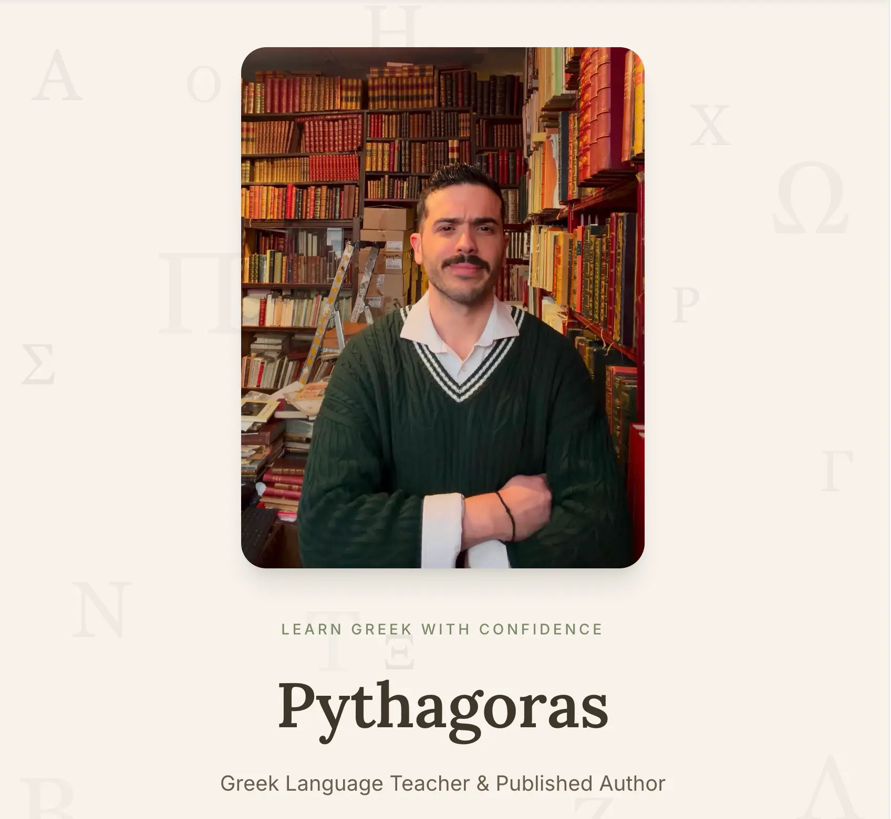

# 🇬🇷 Greek Language Teacher Website

### A modern, warm, and accessible website for a Greek language teacher and published author.

<p align="center">
  
</p>

<p align="center">


</p>

---

## 📖 About the Project

Most language-teacher websites feel like a wall of text. This one doesn't.

It's built around a simple idea: lead with personality and trust, not paragraphs. Visitors get a warm introduction, a clear sense of what lessons look like, real testimonials, and an easy way to get in touch — all wrapped in a calm, editorial design with subtle motion throughout.

---

## ✨ Features

- 🧭 **Sticky navbar** with an animated mobile dropdown that overlays the page instead of pushing content down
- 🎬 **Animated hero** with floating Greek letters and a rotating "Word of the Day" widget
- 📊 **Timeline-style bio** and stat cards in the About section
- 🗂️ **Categorised services** with data-driven highlighted text
- 💬 **Auto-rotating testimonials carousel** — a coverflow-style slider with peeking side cards, pause-on-hover, and full keyboard/reduced-motion support
- 📧 **One-click email copy** on the Contact section
- 🌍 **Full SEO setup** — Open Graph/Twitter cards, JSON-LD structured data, sitemap, and robots.txt
- ♿ **Accessible by default** — semantic HTML, ARIA labels, visible focus states, and respect for `prefers-reduced-motion`

---

## 🛠 Tech Stack

| | |
|---|---|
| ⚡ **Next.js 15** (App Router) | Framework |
| 🔷 **TypeScript** | Type safety |
| 🎨 **Tailwind CSS 4** | Styling, via CSS variables as a design system |
| 🎬 **Motion** | Animation |
| 🪄 **Lucide React** | Icons |
| ▲ **Vercel** | Hosting & deployment |

---

## 🧠 Architecture Decisions

### Data-driven content

Every section pulls its text from `app/data/professor.ts` and `app/data/testimonials.ts` rather than hardcoding copy inside components — so updating a sentence never means touching JSX.

### Custom hook: `useAutoRotate`

Both the Word of the Day widget and the testimonials carousel need the same thing: advance on a timer, pause on hover, and resume without losing progress. Instead of duplicating that logic, it lives once in [`app/hooks/useAutoRotate.ts`](app/hooks/useAutoRotate.ts):

- Tracks *remaining* time on pause (via `setTimeout` + a ref), so hovering and un-hovering resumes the countdown instead of restarting it
- Optionally respects `prefers-reduced-motion` per consumer, since not every auto-rotating element should behave identically
- Returns `{ index, setIndex, isPaused, setIsPaused }` — each component wires up its own hover/focus handlers and interval length

The testimonials carousel builds on top of this with its own "shortest path" sliding logic — when wrapping from the last testimonial back to the first, it slides one step forward through a cloned copy of the array rather than sweeping backward across every card.

### Reusable animation system

Visual animation wrappers live separately from this logic, grouped in `components/animations/`:

- `FadeIn` — fade + slide-up on scroll into view
- `StaggerContainer` / `StaggerItem` — orchestrated staggered reveals for lists of children

### Accessibility

Auto-rotating content (Word of the Day, testimonials) always offers a way to pause or jump directly to an item — never purely automatic with no escape. Decorative-only elements (floating Greek letters) are marked `aria-hidden`. Everything respects the OS-level reduced-motion setting.

---

## 📁 Project Structure

```text
app/
│
├── components/
│   ├── Navbar.tsx
│   ├── Hero.tsx
│   ├── About.tsx
│   ├── WhyChooseMe.tsx
│   ├── Services.tsx
│   ├── Testimonials.tsx
│   ├── Contact.tsx
│   ├── Footer.tsx
│   ├── EmailCopy.tsx
│   ├── WordOfDay.tsx
│   │
│   └── animations/
│       ├── FadeIn.tsx
│       ├── StaggerContainer.tsx
│       ├── StaggerItem.tsx
│       └── FloatingLetters.tsx
│
├── hooks/
│   └── useAutoRotate.ts
│
├── data/
│   ├── professor.ts
│   ├── testimonials.ts
│   └── heroDecorations.ts
│
├── globals.css
├── layout.tsx
├── page.tsx
├── sitemap.ts
├── robots.ts
├── icon.png
└── apple-icon.png
```

---

## 🔍 SEO & Discoverability

- Metadata (title, description, keywords) includes the teacher's name in both English and Greek
- Open Graph & Twitter card images for clean link previews on WhatsApp, Facebook, etc.
- JSON-LD `Person` structured data with social links (`sameAs`)
- Auto-generated `sitemap.xml` and `robots.txt` via Next.js file conventions
- Custom favicon and apple-touch-icon (no default framework branding)

---

## 🚀 Getting Started

```bash
git clone <repository-url>
npm install
npm run dev
```

Then open [http://localhost:3000](http://localhost:3000).

---

## 🌍 Deployment

Deployed on Vercel — pushing to the connected GitHub repository triggers an automatic production build.

```bash
npm run build
```

---

## 👨‍💻 Author

Designed and developed by [Anastasia Tsapanidou Kornilaki](https://www.chaptersbyanastasia.dev/) using Next.js, TypeScript, Tailwind CSS, Motion, and Lucide Icons.
